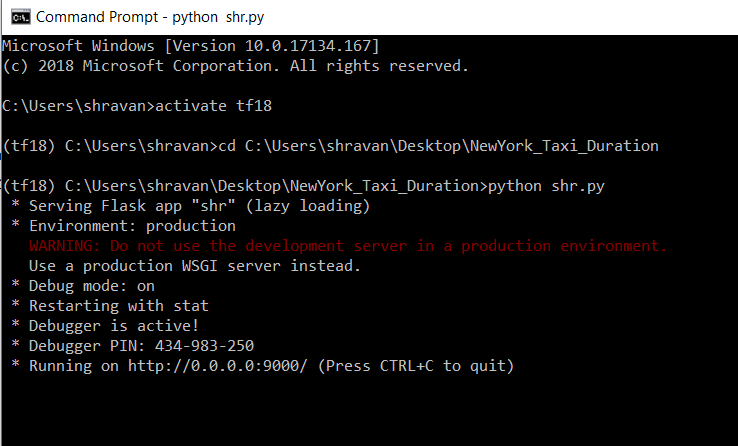
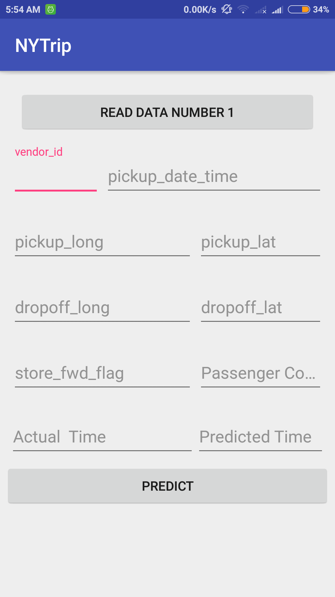
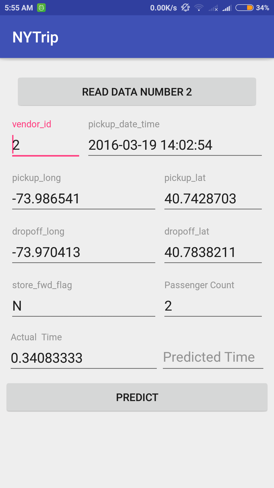
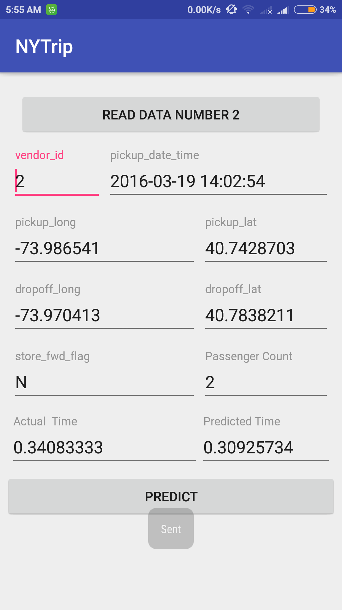

# Deploying-a-machine-learning-model-into-production-using-Android-and-Flask
I have been studying Machine Learning for the past 7-8 months , during that period of time while understanding the maths and theoritical concepts I always wondered how will it be to deoloy a model into production , since then I wanted to make my own app for a perticular case study.<br>
Previously I have solved a case study "New York Taxi Duration" which appeared on kaggle competition.<br>You can find the developmnent of the model **here** :<br>
This project will be a extention to that case study ,I am trying to create an end to end system.
<br>. Here a client server architecture is used, the model is running on a local machine and whenever an android sends data to the server , the server interprets the data, cleans the data and then feeds it to the machine learning model which then gives us a predicted value which is sent to the android .
* Here cleaning of data means whatever data augmentation feature engineering steps were  performed while creating the model have to be performed on the testing data.So make sure you understand my case study from the above mentioned **link**<br> 
 ## Pre-requisites
 * You can dowload the model from this link https://drive.google.com/open?id=1L8t5EWOjeDoY_jp2VfYnpf2Zp4tlgJMD .
 * Make sure flask is installed if not then use this command<br>
 **pip install flask**<br>
 * What is flask?
 Flask is a micro web framework written in Python.It is very light-weighted and used for speedy development.
 * Android version 5.0 or above.
 ## Steps in Initializing the server
* Just go to the directory and in command prompt enter
```
python shr.py
```
Something like this must come up.
<br>
* Now your server is running.
* You can try hitting the server by typing youripaddress:9000 in any browser a response "Hello" should be seen.
* To know your ip address go to cmd->type ipconfig->ipv4 address is your ip address.
### Steps in Initializing the Android App.
* Make sure that the server and android phone is on the same network.
* Enter you ip address and enter port number as 9000.
* There is a CSV embedded in the android app for testing you can just click the "Load CSV" button to load the csv.
* After loading the csv Start reading the datapoints one by one.
**Note**:Since the data embedded inside the android app is random selection of data and if you have trained it in completely different data then some prediction errors may happen. If you want good accuracy then open the android project and copy your testing data in resource->raw directory from android studio and compile the app again.
## File Contents
* mean_values.csv and var_values.csv these values are used to standarize the test point.
* final_model.pkl is the final RandomForest model saved .
**Note**:Replace the above 3 files if you have trained your own model .
* shr.py this is actual flask web server file responsible to process the data and model is loaded in this file.
* temp1.py this file contains the class that is responsible for feature engineering the test data(couldn't think of a better name then).
# Working of the server 
* In flask there are different routes you can take using the 'ipaddress:portnumber' and for any defined route you have an function associated with it this function will be called if user goes to that route.
* As you can see in shr.py line 16 , when no route is specified then a function which displays a "Hello" message is  called when a route 'ipaddress:portnumber/api' is mentoned then another function is called.
* Since data is passed as json format , whenever /api is called then a json must be sent else eror is thrown.
* After a json is recieved ,all the string datatypes are converted into numeric if any  it is then converted into pandas DataFrame from where all the feature engineering steps are taken place , then ultimately a predicted value in json format is sent to the android app.
## Working of the App
* The android app is sending a json data and is expecting a json reply from the server.
* I am using volley which is a network library which makes networking for android apps fast and easy.
* Since I am using an embedded data file there is no need to manually type any test data point.
* Whenever the "predict" button is clicked the loaded data is converted into a json format and using the ip address and port number provided earlier, the jsonified data is sent to server.
* Whenever a response is recieved from the server the results are displayed.
## ScreenShots
 ### Loading of csv
<br><br>
 ### Loading one datapoint 
<br><br>
 ### Recieving the response from server
<br><br>

<br>
For any queries please email me at shravannambiar@gmail.com
